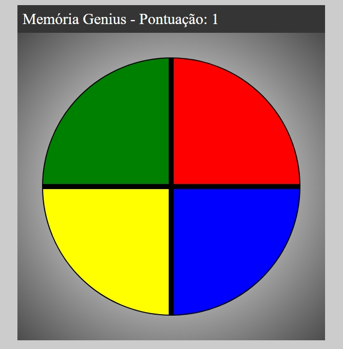

<h1 align="center">
Genius Memoria JS
</h1>

Este projeto foi desenvolvido para fins de estudo, 
Jogo Gênesis utilizando apenas HTML, CSS e Javascript. 

  
   

## Resultado da aplicação

    

## Objetivo do Projeto
O foco principal foi nos conceitos de CSS Grid, manipulação de Array e Arrow Functions.

## Oque foi praticado
Nesse projeto foi praticado tecnicas basicas de HTML e CSS para criar e estilizar o layout. O JavaScript foi usado para gerar a 
aleatoriedade das cores e verificar se a orde foi incluida corretamente no game.
Como um desafio extra, adicionei um layout diferente e um placar funcional feito com JS.

## Tecnologias Utilizadas

- [X] HTML5
- [X] CSS3
- [X] CSS Grid

## Deploy
O deploy da pagina foi feito atravez da plataforma Vercel  
Link do Deploy: https://genius-memoria.vercel.app/
